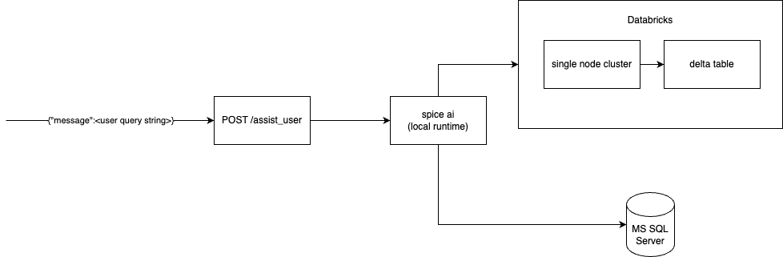
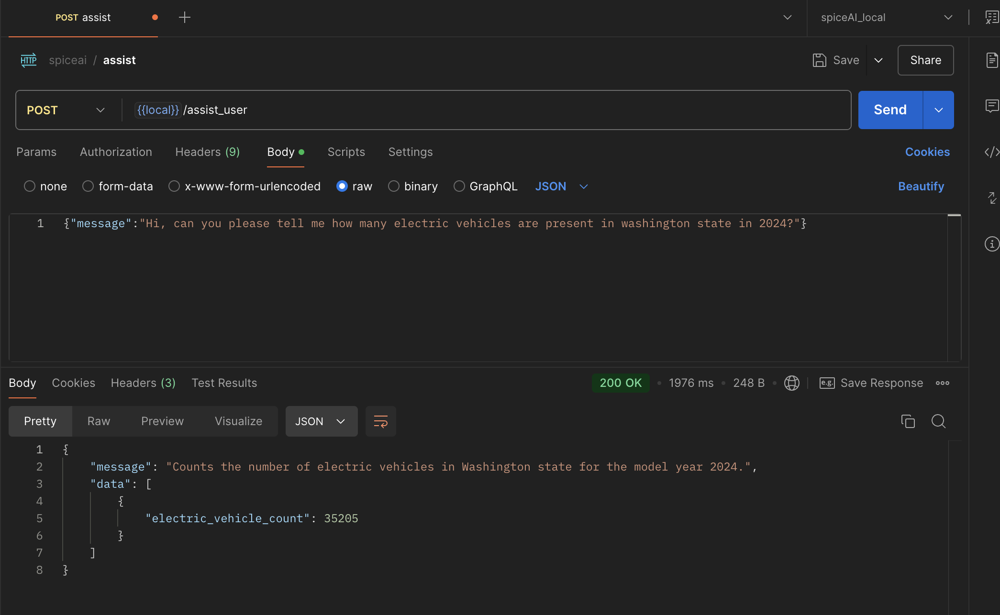
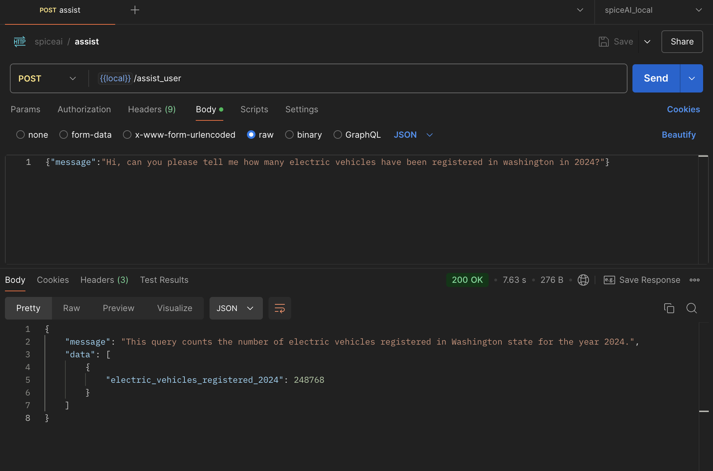

# Spice AI Take-Home Assessment

Welcome to [Manu Hegde](github.com/manuhg)'s Spice AI take-home assessment. This repository implements a simple user assistant robot that leverages ChatGPT along with data from Microsoft SQL Server database and Databricks delta tables.

Two datasets are currently used. 
- **wa_ev_population_data** : A very small table with 210K rows/~50MB of data that resides in Microsoft SQL server db in Azure Cloud. Contains data regarding the electric vehicles in washington state.
- **wa_ev_registration_activity** : A larger table with 1.1Mn rows/~500MB of data that resides as a delta table in Azure Databricks. Contains records of electric vehicle registrations in washington state.


## How to run
- Install spice ai on your machine
- Run `env_gen_hack.sh` to generate .env file with necessary credentials
- Run the spice ai server locally with the command `spice run`
- Run the `manu_spicy_assistant` crate
- This runs the server at `localhost:3000`
- Use your favourite API testing tool (eg: [Postman](https://www.postman.com/)) to test the API endpoints. For examples, please look at [sample runs](#sample-runs)  
  
Note: If you ask questions regarding EV registration activity, it may take a couple of minutes in the beggining since `wa_ev_registration_activity` table resides in Databricks. The cluster will take few minutes to boot up the first time and shuts down after 10 mins of idle time.
## API Endpoints
- `GET /` (api root): Gives a welcome message 
- `GET /greet/:name`: Greets the user
- `POST /assist_user`: Assists the user with queries on electric vehicle population and registrations in Washington state
  - input: Expects JSON with a field called 'message'  
        ex: `{"message":"Hi, can you please tell me how many electric vehicles have been registered in washington in 2024?"}`
  - response: Returns a JSON with `data` field and `message` field to explain the data.   
        ex:`{ "message": "This query counts the number of BMW electric vehicles present in Washington state for the model year 2024.",  
              "data": [ {"bmw_ev_count": 1920 } ]
             }`  

> Note: The project was developed with a local server of Spice.ai OSS. Since storing credentials in plaintext isn't recommended. However in the present scenario where the interviwer needs to run the code independently on their machine, credentials need to be stored somewhere convenient. Hence, as a hack, I have base64 encoded and stored all the necessary credentials in the bash script  `env_gen_hack.sh`.

## Sample Runs
- from `wa_ev_population_data` (MS SQL Server):  
  `curl --location 'localhost:3000/assist_user' \
  --header 'Content-Type: application/json' \
  --data '{"message":"Hi, can you please tell me how many electric vehicles are present in washington state in 2024?"}'`
  
- from `wa_ev_registration_activity` (Databricks Delta):    
`curl --location 'localhost:3000/assist_user' \
--header 'Content-Type: application/json' \
--data '{"message":"Hi, can you please tell me how many electric vehicles have been registered in washington in 2024?"}'`




## Table Definitions
```
CREATE TABLE wa_ev_population_data (
vin VARCHAR(10),
county VARCHAR(50),
city VARCHAR(50),
state CHAR(2),
postal_code VARCHAR(10),
model_year SMALLINT,
make VARCHAR(30),
model VARCHAR(30),
electric_vehicle_type VARCHAR(50),
cafv_eligibility VARCHAR(100),
electric_range SMALLINT,
base_msrp DECIMAL(10, 2),
legislative_district SMALLINT,
dol_vehicle_id BIGINT,
vehicle_location GEOGRAPHY,
electric_utility VARCHAR(100),
census_tract BIGINT
);
```
```
CREATE TABLE wa_ev_registration_activity (
clean_alt_fuel_vehicle_type VARCHAR(60),
vin VARCHAR(10),
dol_vehicle_id BIGINT,
model_year SMALLINT,
make VARCHAR(30),
model VARCHAR(30),
primary_use VARCHAR(20),
electric_range SMALLINT,
odometer_reading BIGINT,
odometer_reading_description VARCHAR(50),
new_or_used_vehicle VARCHAR(10),
sale_price DECIMAL(10, 2),
sale_date DATE,
base_msrp DECIMAL(10, 2),
transaction_type VARCHAR(50),
transaction_date DATE,
year SMALLINT,
county VARCHAR(50),
city VARCHAR(50),
state CHAR(2),
postal_code VARCHAR(10),
hb_2042_cafv_eligibility VARCHAR(100),
meets_2019_hb_2042_electric_range_req BOOLEAN,
meets_2019_hb_2042_sale_date_req BOOLEAN,
meets_2019_hb_2042_sale_price_value_req BOOLEAN,
2019_hb_2042_battery_range_req_met VARCHAR(100),
2019_hb_2042_purchase_date_requirement VARCHAR(100),
2019_hb_2042_sale_price_value_requirement VARCHAR(100),
electric_vehicle_fee_paid VARCHAR(20),
transportation_electrification_fee_paid VARCHAR(20),
hybrid_vehicle_electrification_fee_paid VARCHAR(20),
geoid BIGINT,
legislative_district SMALLINT,
electric_utility VARCHAR(100)
);
```
